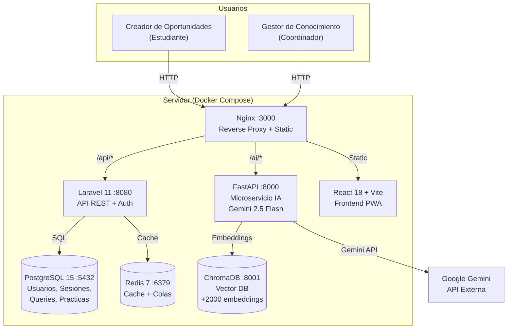
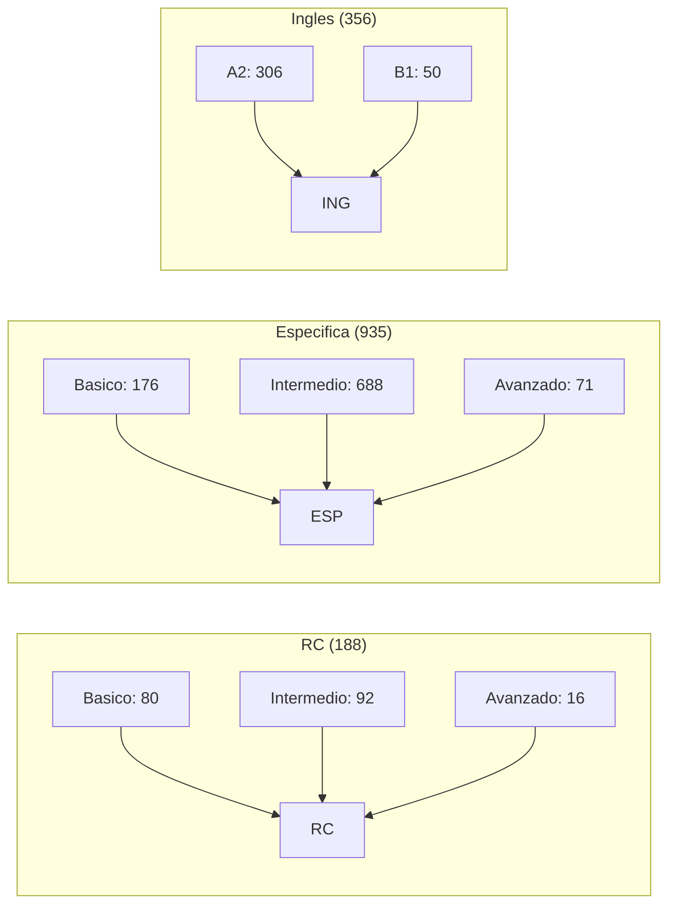
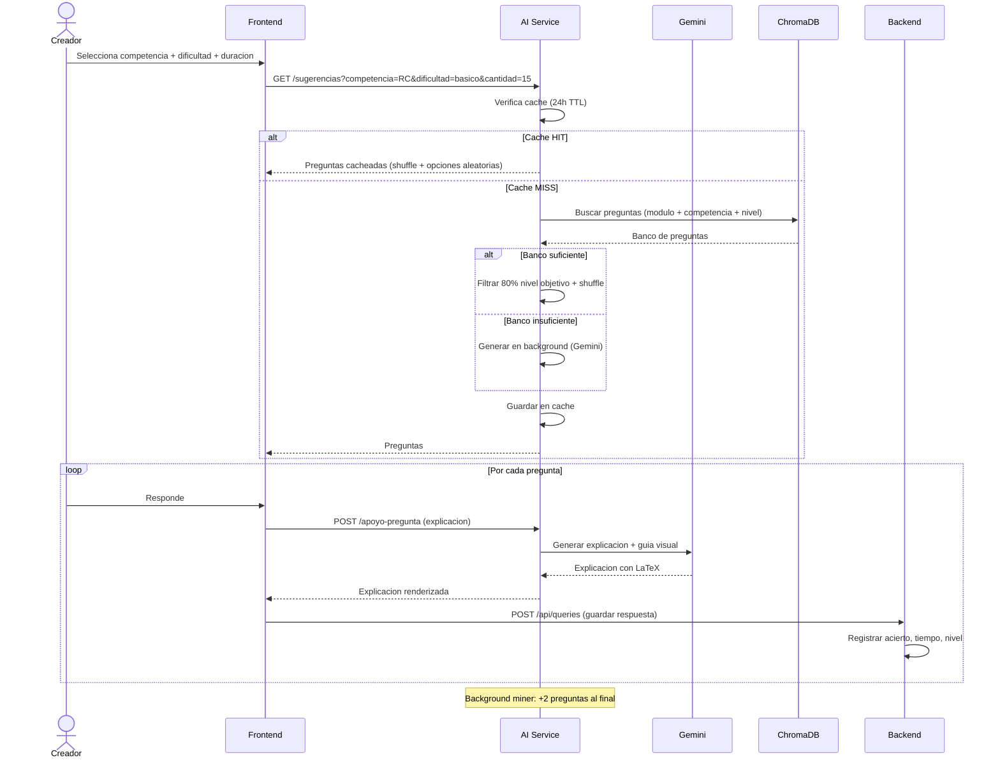
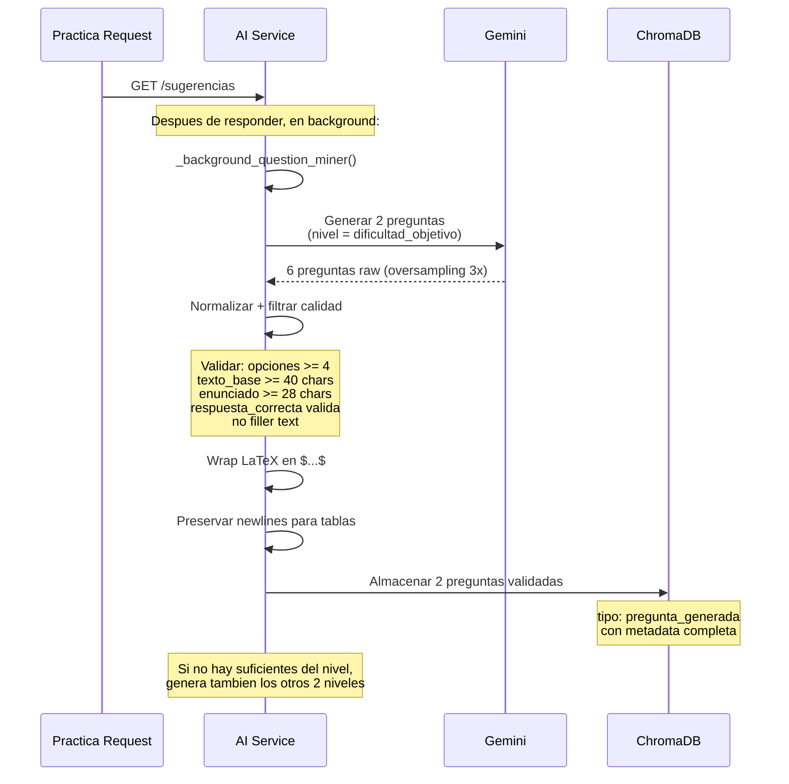
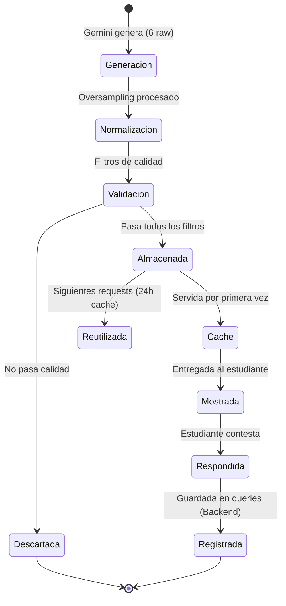
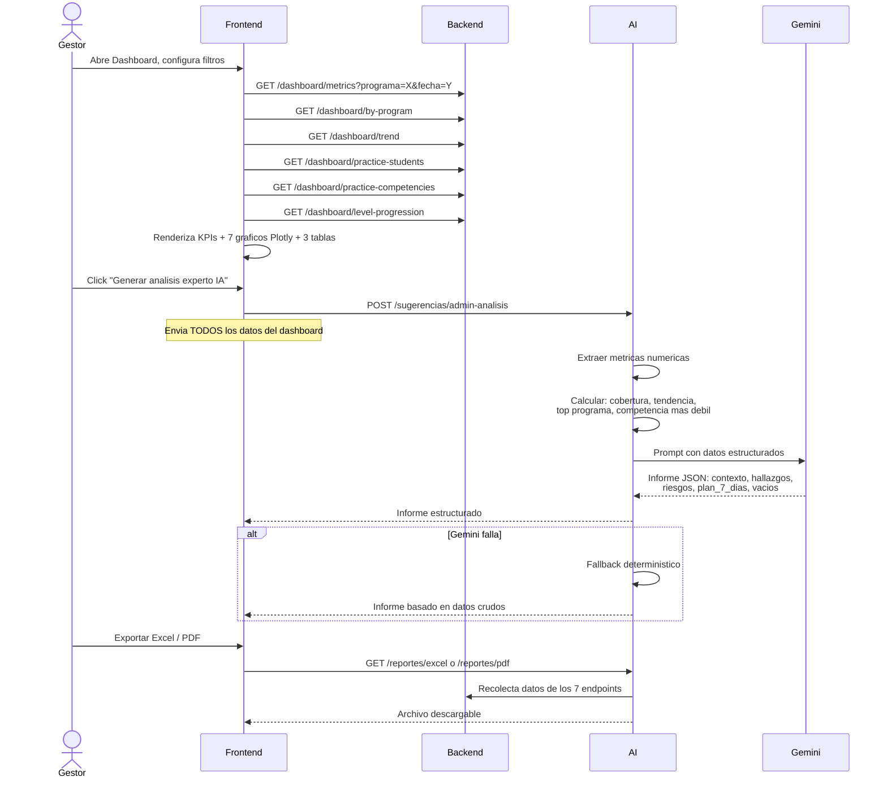
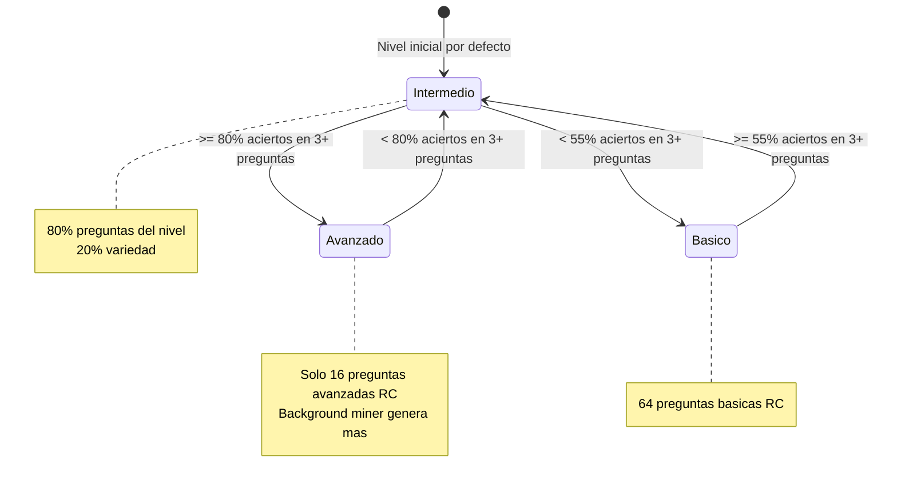
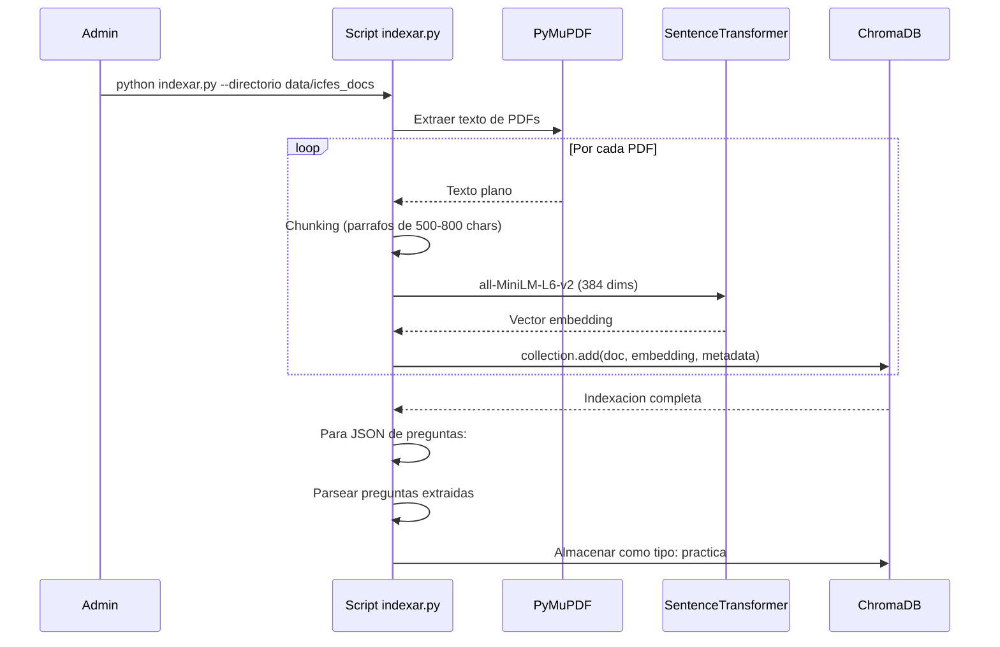
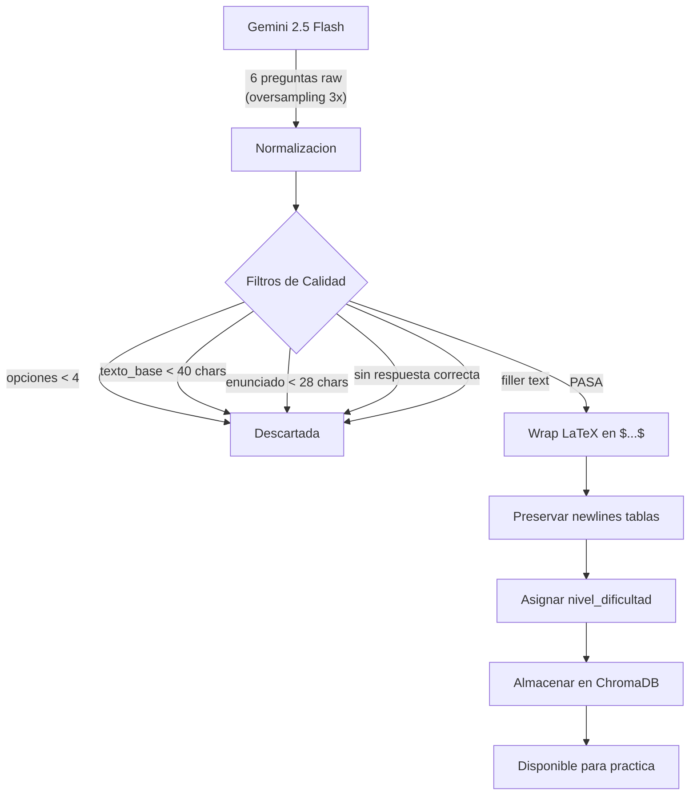

# Documentacion Tecnica - Asistente Saber Pro ICFES

## 1. Arquitectura del Sistema (C4 - Contenedores)



### Explicacion

Este diagrama muestra la arquitectura de **6 servicios Docker** orquestados con Docker Compose:

- **Nginx (:3000):** Unico punto de entrada. Sirve archivos estaticos del frontend y hace reverse proxy hacia backend (`/api/*`) y microservicio IA (`/ai/*`)
- **Frontend (React + Vite):** SPA para creadores y gestores. Se comunica con backend para auth y dashboard, y directo con la IA para practicas
- **Backend (Laravel 11 :8080):** API REST con autenticacion, registro de consultas y 8 endpoints de metricas para el dashboard
- **Microservicio IA (FastAPI :8000):** Motor principal: genera preguntas con Gemini, gestiona ChromaDB (+2000 embeddings), exporta reportes Excel/PDF
- **PostgreSQL (:5432):** 13 tablas con estudiantes, coordinadores, consultas, practicas y sesiones
- **ChromaDB (:8001):** Base vectorial con embeddings para busqueda semantica de preguntas
- **Redis (:6379):** Cache para sesiones, colas y datos frecuentes del dashboard
- **Gemini API:** Servicio externo de Google para generacion de preguntas, explicaciones e informes

Los dos roles (Creador y Gestor) acceden unicamente por Nginx, que enruta segun la ruta.

---

## 2. Diagrama Entidad-Relacion (ERD)

```mermaid
erDiagram
    students ||--o{ queries : "realiza consultas<br/>y practicas"
    students ||--o{ personal_access_tokens : "tiene tokens<br/>de acceso API"
    coordinators ||--o{ personal_access_tokens : "tiene tokens<br/>de acceso API"
    users ||--o{ personal_access_tokens : "tiene tokens<br/>de acceso API"
    students ||--o{ sessions : "mantiene sesiones<br/>de navegador"
    users ||--o{ sessions : "mantiene sesiones<br/>de navegador"
    
    students {
        bigint id PK "autoincremental"
        varchar cedula UK "20 - identificador unico del estudiante"
        varchar nombre "150 - nombre completo"
        varchar programa "100 - carrera academica"
        varchar password_hash "255 - bcrypt hash"
    }

    coordinators {
        bigint id PK "autoincremental"
        varchar nombre "150 - nombre completo"
        varchar email UK "255 - correo institucional"
        varchar password "255 - bcrypt hash"
    }

    users {
        bigint id PK "autoincremental - Laravel auth nativo"
        varchar name "255"
        varchar email UK "255"
        timestamp email_verified_at "nullable - verificacion de email"
        varchar password "255 - bcrypt hash"
        varchar remember_token "100 - sesion persistente"
    }

    queries {
        bigint id PK "autoincremental"
        bigint student_id FK "ref → students.id (logica, sin FK)"
        varchar student_hash "64 - SHA-256 anonimizado"
        varchar student_nombre "150 - nombre del estudiante"
        varchar programa "100 - carrera en el momento"
        varchar competencia "100 - competencia ICFES"
        text pregunta "texto completo de la pregunta"
        text respuesta "opcion elegida + correcta + explicacion"
        boolean es_practica "true = practica, false = consulta"
        boolean acierto "resultado (nullable hasta evaluacion)"
        varchar nivel_pregunta "20 - basico/intermedio/avanzado/A2/B1"
        varchar nivel_objetivo "20 - nivel adaptativo del estudiante"
        varchar tipo_pregunta "40 - part1-part7 (solo Ingles)"
        int tiempo_respuesta_ms "milisegundos en responder"
        boolean calificacion "utilidad reportada por estudiante"
    }

    sessions {
        varchar id PK "255 - ID de sesion Laravel"
        bigint user_id FK "ref → users.id o students.cedula"
        varchar ip_address "45"
        text user_agent "navegador del usuario"
        text payload "datos serializados de sesion"
        int last_activity "timestamp ultima actividad"
    }

    personal_access_tokens {
        bigint id PK "autoincremental - Sanctum API tokens"
        varchar tokenable_type "255 - students, users o coordinators"
        bigint tokenable_id "ID del modelo dueno del token"
        text name "nombre descriptivo del token"
        varchar token UK "64 - hash SHA-256 del token"
        text abilities "permisos del token (json)"
        timestamp last_used_at "ultimo uso del token"
        timestamp expires_at "fecha de expiracion"
    }

    cache {
        varchar key PK "255 - clave de cache"
        text value "valor serializado"
        int expiration "timestamp de expiracion"
    }

     jobs {
        bigint id PK "autoincremental - cola de trabajos"
        varchar queue "255 - nombre de la cola"
        text payload "trabajo serializado (JSON)"
        smallint attempts "intentos realizados"
        int available_at "timestamp de disponibilidad"
        int created_at "timestamp de creacion"
    }
```



### Explicacion

El diagrama entidad-relacion muestra las 10 tablas de la base de datos PostgreSQL y sus relaciones logicas. Se distinguen tres categorias: tablas de dominio (`students`, `coordinators`, `queries`), tablas de autenticacion (`users`, `personal_access_tokens`, `sessions`) y tablas de infraestructura Laravel (`cache`, `jobs`). La estructura esta optimizada para consultas analiticas del dashboard, no para integridad referencial estricta.

La tabla `queries` es el nucleo del sistema: almacena cada interaccion del estudiante (practica o consulta) con 17 columnas que registran competencia, respuesta, acierto, tiempo de respuesta en milisegundos y nivel adaptativo. La tabla `students` usa la cedula como identificador unico y se relaciona con queries sin FK fisica para preservar el historial aunque el estudiante sea eliminado. `personal_access_tokens` usa un diseno polimorfico de Sanctum (`tokenable_type` + `tokenable_id`) para servir tokens a los tres tipos de usuarios (students, users, coordinators) desde una sola tabla.

Las relaciones son logicas, no fisicas. Cada query pertenece a un estudiante via `student_id`. Las sesiones web se vinculan a users por `user_id`. Las tablas de infraestructura (cache, jobs, migrations) son gestionadas internamente por Laravel y no tienen relacion directa con el dominio academico. Esto permite que el backend opere con flexibilidad: eliminar un estudiante no borra sus consultas historicas.

Los 6 indices compuestos en `queries` son el fundamento de rendimiento: permiten que los 8 endpoints del dashboard del gestor ejecuten filtros por programa, competencia, nivel y fecha con tiempos de respuesta bajos. La tabla `queries` esta disenada para lectura analitica intensiva, razon por la cual se priorizan indices multicolumna sobre restricciones de integridad referencial.

### Como se conectan las tablas

**Relaciones principales (logicas, sin FK en BD):**

| Relacion | Como se conecta | Por que |
|----------|----------------|---------|
| `students` → `queries` | `queries.student_id` = `students.id` | Cada consulta/practica pertenece a un estudiante. No tiene FK porque el historial se conserva aunque el estudiante sea eliminado |
| `queries` → Dashboard | Via indices compuestos | Los 8 endpoints del dashboard filtran por `es_practica`, `programa`, `competencia`, `created_at` |
| `sessions` → `users` | `sessions.user_id` = `users.id` | Laravel guarda sesiones web. `user_id` puede ser nulo (invitados) |
| `personal_access_tokens` → Polimorfico | `tokenable_type` + `tokenable_id` | Sanctum permite tokens para `Student`, `User` y `Coordinator` desde una sola tabla |

**Tablas de infraestructura (Laravel interno):**

| Tabla | Funcion |
|-------|---------|
| `cache` / `cache_locks` | Cache de aplicacion (config, rutas, queries) |
| `jobs` / `failed_jobs` / `job_batches` | Cola de trabajos asincronos |
| `migrations` | Registro de migraciones ejecutadas |
| `password_reset_tokens` | Recuperacion de contraseña (no usado actualmente) |

**Indices clave en `queries`**

| Indice | Columnas | Proposito |
|--------|---------|-----------|
| `queries_es_practica_programa_index` | es_practica, programa | Dashboard por programa |
| `queries_es_practica_competencia_nivel_pregunta_index` | es_practica, competencia, nivel_pregunta | Distribucion por dificultad |
| `queries_es_practica_competencia_nivel_objetivo_index` | es_practica, competencia, nivel_objetivo | Nivel adaptativo |
| `queries_programa_competencia_es_practica_index` | programa, competencia, es_practica | Filtros combinados |
| `queries_created_at_index` | created_at | Tendencias diarias |
| `queries_programa_created_at_index` | programa, created_at | Tendencia por programa |

---

## 3. ChromaDB - Coleccion `saberpro_docs`

### Estructura de Documentos

| Tipo | Cantidad | Formato | Origen |
|------|---------|---------|--------|
| `pregunta_generada` | ~1600 | JSON (Pregunta) | Gemini 2.5 Flash |
| `pregunta` | 0 (eliminadas) | Texto plano | PDF ICFES curado |
| `practica` | ~200 | Texto plano | PDFs ICFES 2019-2021 |
| `ejemplo` | ~80 | Texto plano | PDFs ejemplos explicados |

### Metadatos por tipo

**pregunta_generada:**
```json
{
    "modulo": "general",
    "tipo": "pregunta_generada",
    "competencia": "Razonamiento Cuantitativo",
    "programa": "Ingenieria de Sistemas",
    "tipo_ingles": "",
    "nivel_cefr": "",
    "nivel_dificultad": "intermedio",
    "modulo_especifico": ""
}
```

**Documento JSON (pregunta_generada):**
```json
{
    "texto_base": "Un empresa registró... tabla Markdown...",
    "enunciado": "¿Cuál fue el ingreso mensual promedio?",
    "opciones": ["A. USD 13,000", "B. USD 12,500", "C. USD 11,500", "D. USD 12,000"],
    "respuesta_correcta": "B. USD 12,500",
    "explicacion": "$\\frac{75000}{6} = 12500$...",
    "competencia": "Razonamiento Cuantitativo",
    "programa": "Ingenieria de Sistemas",
    "nivel_dificultad": "intermedio",
    "bloque_id": "RC-1",
    "orden_en_bloque": 1,
    "preguntas_en_bloque": 2
}
```

### Distribucion por Competencia y Dificultad



### Explicacion

El grafico de distribucion muestra como estan organizados los mas de 2000 documentos en la coleccion `saberpro_docs` de ChromaDB, agrupados por competencia ICFES y nivel de dificultad. Existen 4 tipos de documentos: `pregunta_generada` (~1600, creados por Gemini), `practica` (~200, extraidos de PDFs ICFES 2019-2021), `ejemplo` (~80, explicados) y `pregunta` (tipo legacy, actualmente sin documentos).

Cada documento almacena metadatos completos (modulo, competencia, programa, nivel_dificultad, tipo) que permiten al motor de sugerencias hacer consultas filtradas por combinaciones de competencia + nivel + programa. Las preguntas generadas incluyen adicionalmente un JSON completo con `texto_base`, `enunciado`, `opciones`, `respuesta_correcta` y `explicacion` en formato LaTeX, lo que las hace autocontenidas y listas para servir al estudiante.

La distribucion revela que la competencia Especifica domina el banco con 935 documentos, seguida de Ingles con 356 y Razonamiento Cuantitativo con 188. Dentro de RC, hay solo 16 preguntas avanzadas contra 80 basicas y 92 intermedias. Esta asimetria refleja que el sistema prioriza los niveles donde se concentra la mayoria de estudiantes, pero tambien expone una debilidad que el background miner esta disenado para corregir.

La baja cantidad de preguntas avanzadas en RC limita las practicas de estudiantes en ese nivel, razon por la cual el background miner genera automaticamente mas preguntas cuando detecta escasez en un nivel especifico. Los metadatos detallados permiten ademas que el chat RAG recupere documentos semanticamente relevantes para responder consultas de estudiantes con contexto fundamentado en material ICFES real.

---

## 4. Flujo: Practica de Estudiante



### Explicacion

El diagrama de secuencia detalla el flujo completo de una practica estudiantil, desde la seleccion de parametros hasta el registro de cada respuesta. El AI Service actua como orquestador central: recibe la solicitud de preguntas, verifica cache con TTL de 24 horas, consulta ChromaDB para recuperar preguntas del nivel objetivo y, si el banco es insuficiente, dispara generacion en background con Gemini sin bloquear al estudiante.

El flujo se divide en tres fases. Primero, la obtencion de preguntas usa una estrategia cache-first: si hay preguntas en cache, se entregan inmediatamente con shuffle y opciones aleatorias; si no, se buscan en ChromaDB filtrando por modulo, competencia y nivel. Segundo, un loop de respuesta donde cada interaccion del estudiante genera una explicacion personalizada con LaTeX via Gemini y se registra en el backend (con tiempo de respuesta, acierto y nivel). Tercero, el background miner genera dos preguntas nuevas al finalizar para enriquecer el banco.

La distribucion de preguntas sigue la regla 80/20: el 80% son del nivel objetivo del estudiante y el 20% son de variedad (otros niveles), lo que mantiene la practica desafiante pero no frustrante. La cache de 24 horas evita consultas repetitivas a ChromaDB y Gemini, optimizando latencia y reduciendo costos de API externa.

El registro en backend de cada respuesta individual alimenta los 8 endpoints del dashboard del gestor y el sistema de nivel adaptativo, creando un ciclo de retroalimentacion donde cada practica mejora tanto la experiencia del estudiante como la inteligencia agregada del sistema.

---

## 5. Flujo: Background Miner (Generacion Automatica)



### Explicacion

El diagrama ilustra el proceso automatico de generacion de preguntas que se ejecuta en segundo plano despues de cada practica, sin interferir con la experiencia del estudiante. La funcion `_background_question_miner()` es el corazon del mecanismo: solicita a Gemini 6 preguntas raw con oversampling 3x (el triple de las 2 necesarias), aplica filtros de calidad y almacena las mejores en ChromaDB.

Los filtros de calidad son cinco compuertas secuenciales: minimo 4 opciones de respuesta, texto_base de al menos 40 caracteres, enunciado de al menos 28 caracteres, presencia de una respuesta correcta valida y ausencia de texto basura (filler text). Ademas, el sistema normaliza el formato envolviendo expresiones matematicas en `$...$` (LaTeX) y preserva los saltos de linea para que las tablas Markdown se rendericen correctamente en el frontend.

El oversampling 3x es una estrategia de calidad costo-efectiva: Gemini genera mas preguntas de las necesarias sabiendo que varias seran descartadas por los filtros. Si despues del filtrado no hay suficientes preguntas del nivel solicitado, el miner genera automaticamente para los otros dos niveles tambien, asegurando cobertura completa en toda la escala de dificultad. Cada pregunta almacenada incluye metadatos completos (tipo: `pregunta_generada`, competencia, programa, nivel, bloque_id) para ser recuperable por el motor de sugerencias.

Este mecanismo hace que ChromaDB crezca organicamente con cada practica: el banco de preguntas se expande y diversifica sin intervencion manual. La generacion asincrona garantiza que el estudiante nunca espera por contenido nuevo y el sistema nunca se queda sin preguntas para niveles con poca cobertura, como el avanzado de Razonamiento Cuantitativo, que solo tiene 16 preguntas pre-generadas.

---

## 6. Estado: Ciclo de Vida de una Pregunta



### Explicacion

El diagrama de estados modela el ciclo de vida completo de una pregunta como una maquina de estados finitos con 8 estados y 2 estados terminales. El recorrido completo va desde la generacion por Gemini (6 preguntas raw) hasta el registro definitivo en la tabla `queries`, pasando por normalizacion, validacion, almacenamiento, cache, visualizacion y respuesta del estudiante.

Los estados principales representan etapas de calidad y disponibilidad. En Generacion, Gemini produce preguntas con oversampling. En Normalizacion se estandariza el formato. En Validacion se aplican los 5 filtros de calidad: las que fallan van a Descartada (estado terminal), las que pasan a Almacenada en ChromaDB. Desde Almacenada, la pregunta puede ser Cache (servida con TTL 24h), Mostrada (entregada al estudiante), Respondida (contestada) y Registrada (persistida en queries del backend, estado terminal).

La mayoria de preguntas siguen la ruta feliz: Generacion → Normalizacion → Validacion → Almacenada → Cache → Mostrada → Respondida → Registrada. Sin embargo, las preguntas Almacenadas tambien pueden ser Reutilizadas directamente en multiples requests durante las 24 horas de cache, sin necesidad de volver a pasar por los estados intermedios. Esta bifurcacion optimiza el rendimiento evitando pasos redundantes para preguntas ya validadas.

Esta maquina de estados proporciona trazabilidad completa: se sabe exactamente cuantas preguntas se generaron, cuantas pasaron filtros, cuantas fueron servidas y cuantas obtuvieron respuesta. Esto permite calcular metricas de calidad del pipeline de generacion y detectar si Gemini esta produciendo demasiadas preguntas de baja calidad que requieran ajustar los filtros o el prompt. El estado Descartada no es un fracaso sino un mecanismo de control de calidad esperado en el oversampling 3x.

---

## 7. Flujo: Informe Estrategico IA (Gestor)



### Explicacion

El diagrama muestra como un gestor (coordinador academico) genera un informe estrategico impulsado por IA a partir de los datos agregados del dashboard. El flujo tiene cuatro etapas claramente diferenciadas: recoleccion de datos desde 7 endpoints del backend, renderizado de KPIs y graficos en el frontend, generacion del analisis experto via Gemini y exportacion a formatos descargables.

En la primera etapa, el frontend consulta en paralelo los endpoints `/dashboard/metrics`, `/by-program`, `/trend`, `/practice-students`, `/practice-competencies` y `/level-progression`, obteniendo datos agregados de la tabla `queries`. Con esta informacion, el frontend renderiza KPIs numericos, 7 graficos interactivos con Plotly.js y 3 tablas de detalle. El gestor puede filtrar por programa y rango de fechas para enfocar el analisis.

Cuando el gestor solicita el analisis experto, el frontend envia todos los datos del dashboard al AI Service via `POST /sugerencias/admin-analisis`. El AI Service extrae metricas numericas clave (cobertura, tendencia, programa con mejor desempeno, competencia mas debil) y construye un prompt estructurado para Gemini. El modelo devuelve un informe en formato JSON con secciones de contexto, hallazgos, riesgos, plan de accion de 7 dias y vacios de conocimiento detectados.

El sistema incluye un mecanismo de fallback deterministico: si Gemini falla o excede el tiempo de respuesta, el AI Service genera un informe basado unicamente en los datos crudos, garantizando que el gestor siempre reciba un analisis util. Finalmente, el gestor puede exportar el informe a Excel o PDF mediante los endpoints `/reportes/excel` y `/reportes/pdf`, que recolectan los datos de los 7 endpoints del dashboard y generan archivos descargables para compartir fuera de la plataforma.

---

## 8. Estado: Nivel Adaptativo del Estudiante



### Explicacion

El diagrama de estados modela el sistema de nivel adaptativo que ajusta automaticamente la dificultad de las preguntas segun el desempeno del estudiante, con tres niveles de competencia: Basico, Intermedio y Avanzado. El nivel inicial por defecto es Intermedio para todos los estudiantes, y el sistema recalcula el nivel cada vez que el estudiante acumula 3 o mas preguntas respondidas.

Las transiciones entre niveles se basan en el porcentaje de aciertos. Para subir de nivel, el estudiante necesita al menos 80% de aciertos (Intermedio → Avanzado, Basico → Intermedio). Para bajar, el umbral es inferior al 55% (Intermedio → Basico, Avanzado → Intermedio). Esto crea una banda de estabilidad en el nivel Intermedio (entre 55% y 80%) donde el estudiante ni sube ni baja, permitiendo que consolide conocimientos antes de avanzar.

Las notas laterales del diagrama revelan informacion critica sobre la distribucion de preguntas. La regla general es 80% de preguntas del nivel objetivo y 20% de variedad, lo que mantiene la practica enfocada pero expone al estudiante a otros niveles. Sin embargo, el nivel Avanzado de RC sufre una limitacion importante: solo existen 16 preguntas avanzadas pre-generadas, y el sistema depende del background miner para generar mas bajo demanda.

El sistema esta disenado para adaptarse al estudiante, no al reves: un estudiante fuerte recibe preguntas progresivamente mas dificiles, mientras que uno con dificultades recibe refuerzo en niveles basicos sin ser penalizado. Esta adaptacion es automatica y transparente: el estudiante solo percibe que las preguntas se ajustan a su nivel sin conocer la maquina de estados subyacente.

---

## 9. Flujo: Indexacion de Documentos ICFES



### Explicacion

El diagrama de secuencia documenta el proceso de ingestion de documentos ICFES en PDF hacia la base de datos vectorial ChromaDB, usando el script `indexar.py` como orquestador del pipeline completo. El administrador ejecuta el script apuntando a un directorio con PDFs, y el sistema procesa cada archivo extrayendo texto, generando embeddings y almacenandolos con metadatos.

El pipeline tiene cuatro etapas. Primero, PyMuPDF extrae el texto plano de cada PDF. Segundo, el texto se divide en chunks de 500 a 800 caracteres, un tamano optimizado para preservar contexto semantico sin exceder la ventana de atencion del modelo de embeddings. Tercero, SentenceTransformer (`all-MiniLM-L6-v2`) convierte cada chunk en un vector de 384 dimensiones, lo suficientemente compacto para busquedas rapidas pero con suficiente poder semantico para recuperar documentos relevantes. Cuarto, ChromaDB almacena el documento original, el embedding vectorial y los metadatos.

Para PDFs que contienen preguntas extraidas en formato JSON, el script las parsea individualmente y las almacena con tipo `practica`, preservando la estructura pregunta-respuesta-explicacion. Esto permite que el motor de sugerencias las recupere y las sirva directamente como preguntas de practica, en lugar de tratarlas como texto generico para RAG.

Este pipeline es la base del sistema RAG (Retrieval-Augmented Generation): cuando un estudiante hace una consulta en el chat, ChromaDB recupera los chunks mas similares semanticamente a la pregunta, y Gemini los usa como contexto para generar respuestas fundamentadas en documentos ICFES reales. Sin esta indexacion, el chat dependeria unicamente del conocimiento general de Gemini, perdiendo precision en contenidos especificos del examen ICFES.

---

## 10. Estructura de Directorios

```
ICFES-PRO-CHAT/
├── docker-compose.yml              # 6 servicios orquestados
├── .env                            # Variables de entorno (gitignored)
├── .env.example                    # Template
├── README.md
├── DOCUMENTACION.md                # Este archivo
├── swagger.json                    # OpenAPI 3.0 spec
│
├── frontend/                       # React 18 + Vite + TypeScript
│   ├── Dockerfile
│   ├── nginx.conf                  # Reverse proxy + WebSocket
│   ├── package.json
│   └── src/
│       ├── api/client.ts           # Axios wrapper
│       ├── pages/
│       │   ├── LoginPage.tsx       # Login creador
│       │   ├── CoordinadorLoginPage.tsx  # Login gestor
│       │   ├── PracticePage.tsx    # Practica (core)
│       │   ├── ChatPage.tsx        # Chat RAG ICFES
│       │   ├── DashboardPage.tsx   # Panel gestor
│       │   └── LandingPage.tsx     # Landing inicial
│       ├── context/                # Auth + Theme
│       └── types/                  # TypeScript interfaces
│
├── backend/                        # Laravel 11 + PHP 8.2
│   ├── app/Controllers/
│   │   ├── AuthController.php      # Login/Registro
│   │   ├── QueryController.php     # Guardar consultas
│   │   └── DashboardController.php # Metricas (8 endpoints)
│   ├── database/migrations/
│   └── routes/api.php
│
├── ai-service/                     # FastAPI + Gemini + ChromaDB
│   ├── main.py                     # Entry point
│   ├── app/
│   │   ├── routes/
│   │   │   ├── sugerencias.py      # Practica + admin (3700 LOC)
│   │   │   ├── consultar.py        # Chat RAG
│   │   │   └── reportes.py         # Excel + PDF
│   │   ├── services/
│   │   │   ├── gemini_client.py    # Gemini API wrapper
│   │   │   ├── chroma_client.py    # ChromaDB singleton
│   │   │   └── rag_service.py      # RAG pipeline
│   │   ├── config/                 # Modulos por programa
│   │   └── scripts/                # Pre-generacion
│   │       ├── indexar.py          # Indexar PDFs
│   │       ├── pre_generar_rc_clean.py
│   │       ├── pre_generar_especificas.py
│   │       ├── curar_preguntas_icfes.py
│   │       └── extractor_json.py
│   │
└── data/                           # Documentos ICFES (PDFs)
    └── icfes_docs/
        ├── general/ejemplos/
        ├── general/practica/
        └── programas/
```

---

## 11. Endpoints API

| Metodo | Ruta | Auth | Descripcion |
|--------|------|------|-------------|
| POST | /api/auth/login | No | Login creador (cedula + clave) |
| POST | /api/auth/register | No | Registro creador |
| POST | /api/auth/coordinator/login | No | Login gestor |
| GET | /sugerencias | No* | Preguntas de practica |
| POST | /sugerencias/apoyo-pregunta | No* | Explicacion + guia visual |
| POST | /sugerencias/datos-curiosos | No* | Datos curiosos ICFES |
| POST | /sugerencias/admin-analisis | No* | Informe estrategico IA |
| POST | /sugerencias/evaluar-ensayo | No* | Evaluar ensayo (Escrita) |
| GET | /reportes/excel | No* | Exportar Excel |
| GET | /reportes/pdf | No* | Exportar PDF |
| POST | /consultar | No* | Chat RAG con documentos |
| POST | /consultar/stream | No* | Chat RAG streaming |
| POST | /consultar/guia-imagen | No* | Generar imagen guia |
| GET | /dashboard/metrics | Gestor | KPIs del dashboard |
| GET | /dashboard/by-program | Gestor | Consultas por programa |
| GET | /dashboard/trend | Gestor | Tendencia diaria |
| GET | /dashboard/top-topics | Gestor | Temas mas consultados |
| GET | /dashboard/practice-students | Gestor | Ranking practica |
| GET | /dashboard/practice-competencies | Gestor | Promedio por competencia |
| GET | /dashboard/level-progression | Gestor | Evolucion de nivel |
| GET | /dashboard/programs | Gestor | Lista de programas |

*Endpoints IA: acceso directo desde frontend (no requieren auth Laravel)

---

## 12. Pipeline de Generacion de Preguntas



### Explicacion

El diagrama de flujo detalla el pipeline completo de generacion de preguntas, desde Gemini 2.5 Flash hasta la disponibilidad para practicas, con enfasis en los filtros de calidad que actuan como compuertas secuenciales. El pipeline es determinista y en cascada: si una pregunta falla cualquier filtro, se descarta inmediatamente sin pasar por etapas posteriores.

El proceso arranca con Gemini generando 6 preguntas raw mediante oversampling 3x (se necesitan 2, se generan 6). La Normalizacion estandariza el formato del texto. Luego vienen cinco filtros de calidad aplicados en orden de costo computacional: primero los filtros de longitud (texto_base >= 40 caracteres, enunciado >= 28 caracteres, minimo 4 opciones), despues los de contenido (respuesta correcta presente, ausencia de texto basura). Las preguntas que superan todos los filtros reciben formato LaTeX (`$...$`), preservan los saltos de linea para tablas Markdown y se les asigna el nivel de dificultad correspondiente antes de almacenarse en ChromaDB.

De las 6 preguntas generadas, tipicamente solo 2 a 4 pasan todos los filtros, y el sistema selecciona las 2 mejores para almacenar. Este diseno acepta que Gemini no siempre produce contenido perfecto y convierte esa variabilidad en una ventaja: el oversampling compensa la impredictibilidad del modelo generativo. El pipeline actua como un control de calidad automatico que evita que texto mal formado llegue al estudiante.

La trazabilidad del pipeline permite auditar cada decision: se registra cuantas preguntas se generaron, cuantas fueron descartadas y por que razon especifica. Esto facilita el ajuste iterativo tanto de los filtros como del prompt enviado a Gemini. Si se detecta que muchas preguntas fallan por "filler text", por ejemplo, se puede refinar el prompt para que Gemini evite frases introductorias genericas. El resultado final es un banco de preguntas de alta calidad que crece organicamente con cada practica.

---

## 13. Stack Tecnologico

| Capa | Tecnologia | Version |
|------|-----------|---------|
| Frontend | React + Vite | 18 / 7 |
| Lenguaje FE | TypeScript | 5.9 |
| Estilos | CSS Modules + KaTeX | - |
| Graficos | Plotly.js | 3.4 |
| Backend API | Laravel | 11 |
| Backend IA | FastAPI (Python) | 0.115 |
| ORM | Eloquent / SQLAlchemy | - |
| IA | Google Gemini | 2.5 Flash |
| Embeddings | SentenceTransformers | all-MiniLM-L6-v2 |
| Vector DB | ChromaDB | 0.5 |
| Cache | Redis | 7 |
| DB | PostgreSQL | 15 |
| Infra | Docker Compose | 3.9 |
| Proxy | Nginx (Alpine) | latest |
