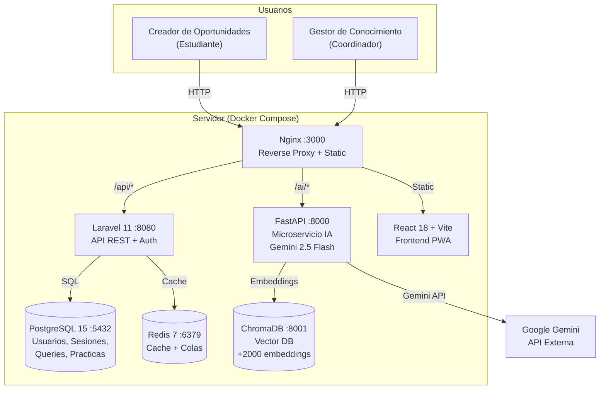
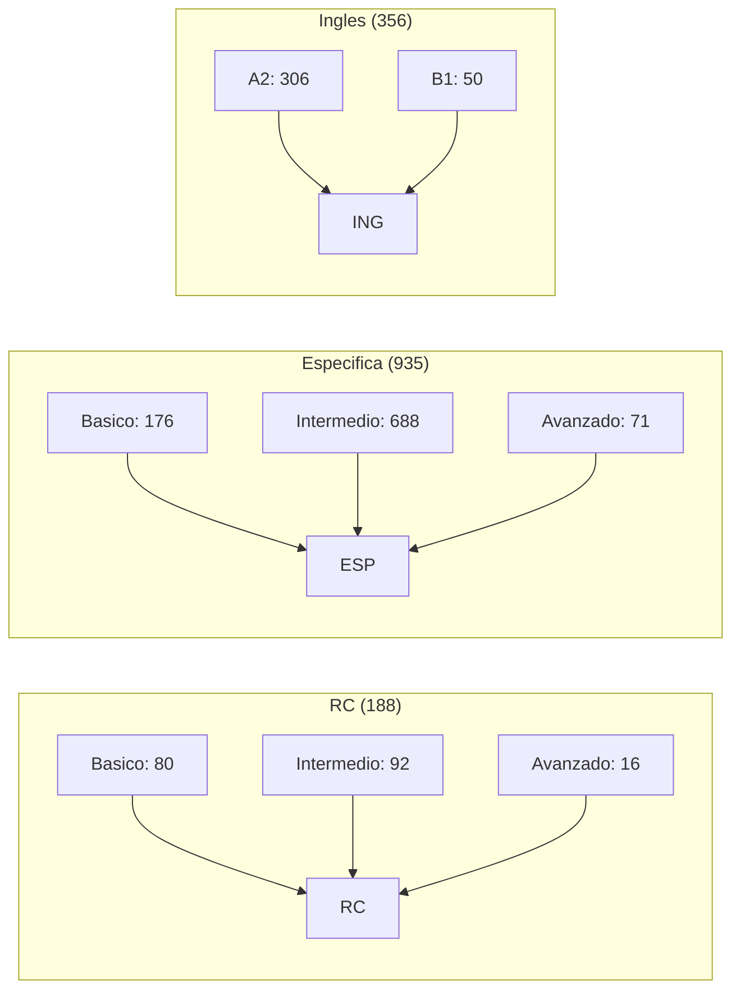
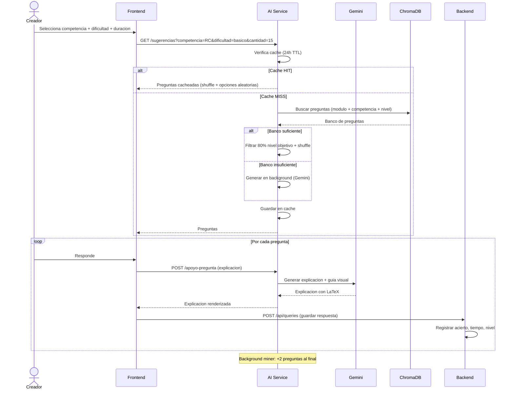
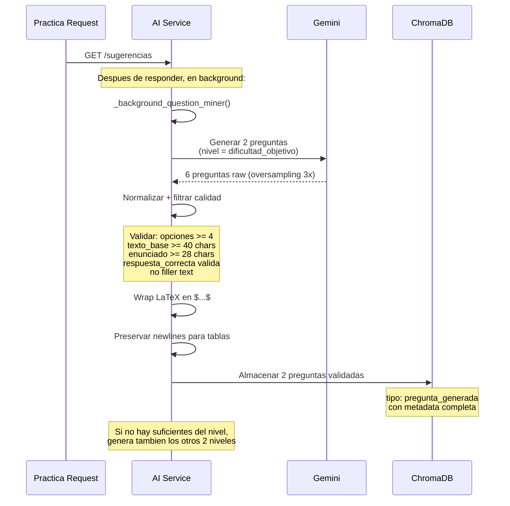
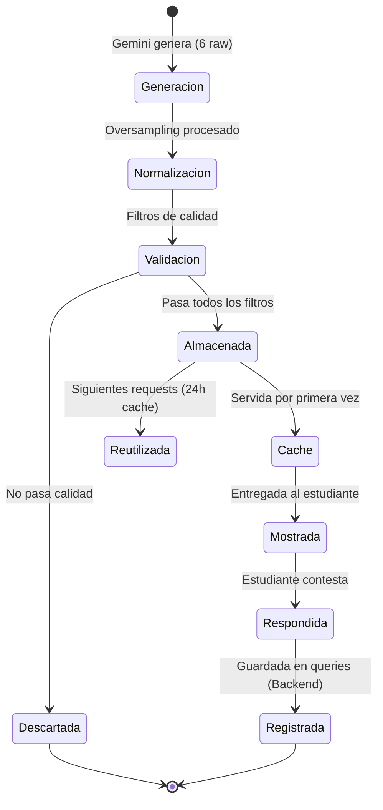
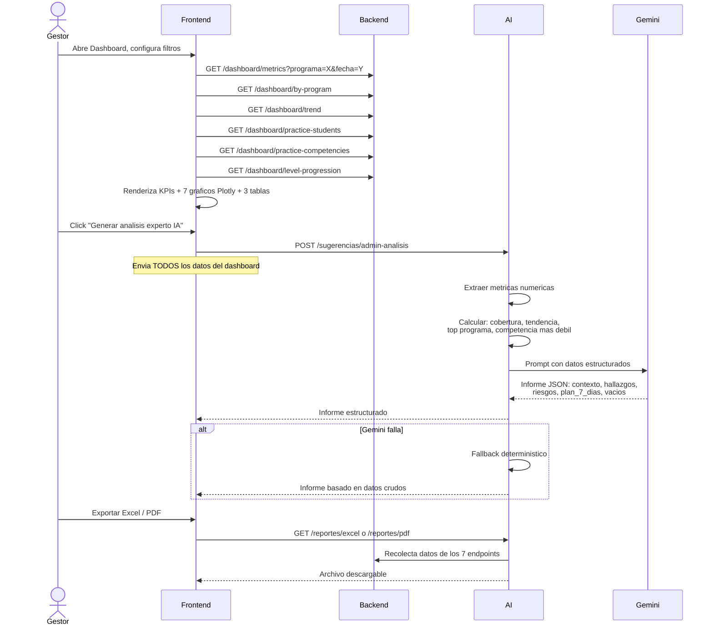
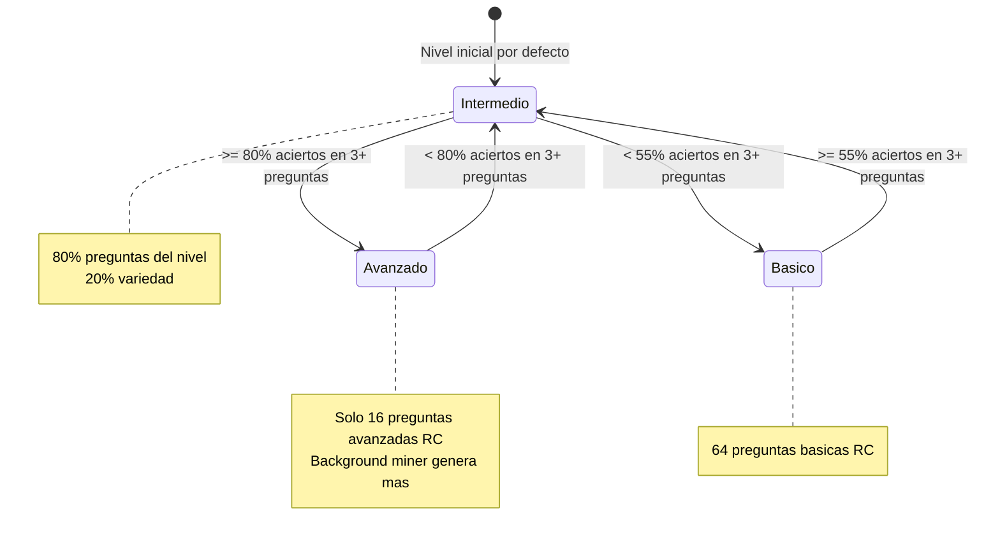
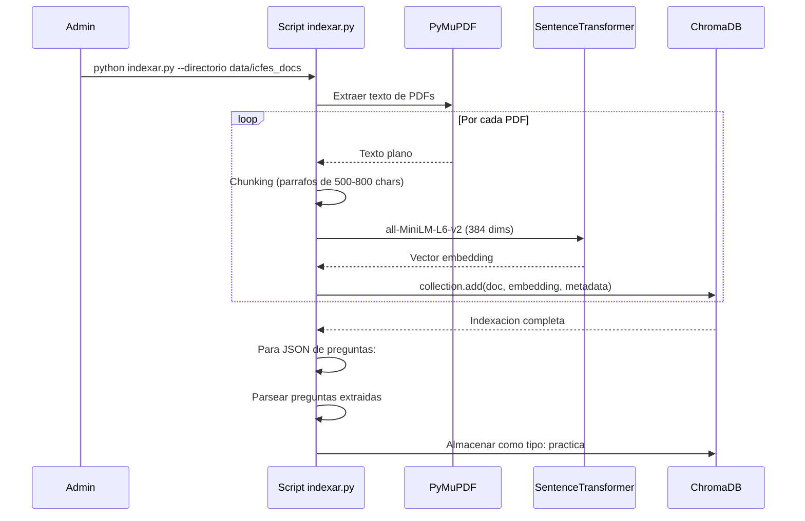
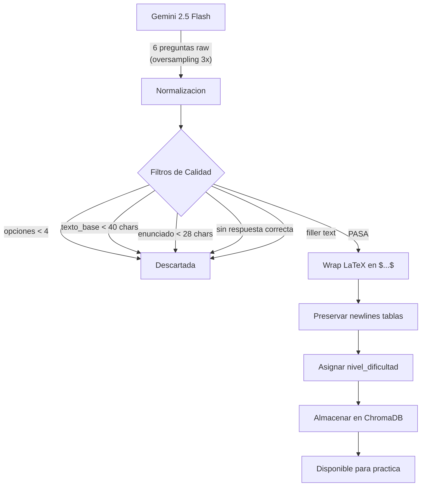

# Documentacion Tecnica - Asistente Saber Pro ICFES

## 1. Arquitectura del Sistema (C4 - Contenedores)



---

## 2. Diagrama Entidad-Relacion (ERD) - PostgreSQL

```mermaid
erDiagram
    students ||--o{ queries : "realiza"
    coordinators ||--o{ personal_access_tokens : "autentica"
    users ||--o{ personal_access_tokens : "autentica"
    
    students {
        bigint id PK
        varchar cedula UK "20"
        varchar nombre "150"
        varchar programa "100"
        varchar password_hash "255"
        timestamp created_at
        timestamp updated_at
    }

    coordinators {
        bigint id PK
        varchar nombre "150"
        varchar email UK "255"
        varchar password "255"
        timestamp created_at
        timestamp updated_at
    }

    users {
        bigint id PK
        varchar name "255"
        varchar email UK "255"
        timestamp email_verified_at
        varchar password "255"
        varchar remember_token "100"
        timestamp created_at
        timestamp updated_at
    }

    queries {
        bigint id PK
        bigint student_id FK
        varchar student_hash "64"
        varchar student_nombre "150"
        varchar programa "100"
        varchar competencia "100"
        text pregunta
        text respuesta
        boolean es_practica
        boolean acierto
        varchar nivel_pregunta "20"
        varchar nivel_objetivo "20"
        varchar tipo_pregunta "40"
        int tiempo_respuesta_ms
        boolean calificacion
        timestamp created_at
        timestamp updated_at
    }

    sessions {
        varchar id PK "255"
        bigint user_id FK
        varchar ip_address "45"
        text user_agent
        text payload
        int last_activity
    }

    personal_access_tokens {
        bigint id PK
        varchar tokenable_type "255"
        bigint tokenable_id
        text name
        varchar token UK "64"
        text abilities
        timestamp last_used_at
        timestamp expires_at
        timestamp created_at
        timestamp updated_at
    }

    cache {
        varchar key PK "255"
        text value
        int expiration
    }

    cache_locks {
        varchar key PK "255"
        varchar owner "255"
        int expiration
    }

    jobs {
        bigint id PK
        varchar queue "255"
        text payload
        smallint attempts
        int reserved_at
        int available_at
        int created_at
    }

    failed_jobs {
        bigint id PK
        varchar uuid UK "255"
        text connection
        text queue
        text payload
        text exception
        timestamp failed_at
    }

    job_batches {
        varchar id PK "255"
        varchar name "255"
        int total_jobs
        int pending_jobs
        int failed_jobs
        text failed_job_ids
        text options
        int created_at
        int finished_at
    }

    password_reset_tokens {
        varchar email PK "255"
        varchar token "255"
        timestamp created_at
    }

    migrations {
        int id PK
        varchar migration "255"
        int batch
    }
```



### Indices clave en `queries`

| Indice | Columnas | Proposito |
|--------|---------|-----------|
| `queries_es_practica_programa_index` | es_practica, programa | Dashboard por programa |
| `queries_es_practica_competencia_nivel_pregunta_index` | es_practica, competencia, nivel_pregunta | Distribucion por dificultad |
| `queries_es_practica_competencia_nivel_objetivo_index` | es_practica, competencia, nivel_objetivo | Nivel adaptativo |
| `queries_programa_competencia_es_practica_index` | programa, competencia, es_practica | Filtros combinados |
| `queries_created_at_index` | created_at | Tendencias diarias |
| `queries_programa_created_at_index` | programa, created_at | Tendencia por programa |

---

## 3. ChromaDB - Coleccion `saberpro_docs`

### Estructura de Documentos

| Tipo | Cantidad | Formato | Origen |
|------|---------|---------|--------|
| `pregunta_generada` | ~1600 | JSON (Pregunta) | Gemini 2.5 Flash |
| `pregunta` | 0 (eliminadas) | Texto plano | PDF ICFES curado |
| `practica` | ~200 | Texto plano | PDFs ICFES 2019-2021 |
| `ejemplo` | ~80 | Texto plano | PDFs ejemplos explicados |

### Metadatos por tipo

**pregunta_generada:**
```json
{
    "modulo": "general",
    "tipo": "pregunta_generada",
    "competencia": "Razonamiento Cuantitativo",
    "programa": "Ingenieria de Sistemas",
    "tipo_ingles": "",
    "nivel_cefr": "",
    "nivel_dificultad": "intermedio",
    "modulo_especifico": ""
}
```

**Documento JSON (pregunta_generada):**
```json
{
    "texto_base": "Un empresa registró... tabla Markdown...",
    "enunciado": "¿Cuál fue el ingreso mensual promedio?",
    "opciones": ["A. USD 13,000", "B. USD 12,500", "C. USD 11,500", "D. USD 12,000"],
    "respuesta_correcta": "B. USD 12,500",
    "explicacion": "$\\frac{75000}{6} = 12500$...",
    "competencia": "Razonamiento Cuantitativo",
    "programa": "Ingenieria de Sistemas",
    "nivel_dificultad": "intermedio",
    "bloque_id": "RC-1",
    "orden_en_bloque": 1,
    "preguntas_en_bloque": 2
}
```

### Distribucion por Competencia y Dificultad



---

## 4. Flujo: Practica de Estudiante



---

## 5. Flujo: Background Miner (Generacion Automatica)



---

## 6. Estado: Ciclo de Vida de una Pregunta



---

## 7. Flujo: Informe Estrategico IA (Gestor)



---

## 8. Estado: Nivel Adaptativo del Estudiante



---

## 9. Flujo: Indexacion de Documentos ICFES



---

## 10. Estructura de Directorios

```
ICFES-PRO-CHAT/
├── docker-compose.yml              # 6 servicios orquestados
├── .env                            # Variables de entorno (gitignored)
├── .env.example                    # Template
├── README.md
├── DOCUMENTACION.md                # Este archivo
├── swagger.json                    # OpenAPI 3.0 spec
│
├── frontend/                       # React 18 + Vite + TypeScript
│   ├── Dockerfile
│   ├── nginx.conf                  # Reverse proxy + WebSocket
│   ├── package.json
│   └── src/
│       ├── api/client.ts           # Axios wrapper
│       ├── pages/
│       │   ├── LoginPage.tsx       # Login creador
│       │   ├── CoordinadorLoginPage.tsx  # Login gestor
│       │   ├── PracticePage.tsx    # Practica (core)
│       │   ├── ChatPage.tsx        # Chat RAG ICFES
│       │   ├── DashboardPage.tsx   # Panel gestor
│       │   └── LandingPage.tsx     # Landing inicial
│       ├── context/                # Auth + Theme
│       └── types/                  # TypeScript interfaces
│
├── backend/                        # Laravel 11 + PHP 8.2
│   ├── app/Controllers/
│   │   ├── AuthController.php      # Login/Registro
│   │   ├── QueryController.php     # Guardar consultas
│   │   └── DashboardController.php # Metricas (8 endpoints)
│   ├── database/migrations/
│   └── routes/api.php
│
├── ai-service/                     # FastAPI + Gemini + ChromaDB
│   ├── main.py                     # Entry point
│   ├── app/
│   │   ├── routes/
│   │   │   ├── sugerencias.py      # Practica + admin (3700 LOC)
│   │   │   ├── consultar.py        # Chat RAG
│   │   │   └── reportes.py         # Excel + PDF
│   │   ├── services/
│   │   │   ├── gemini_client.py    # Gemini API wrapper
│   │   │   ├── chroma_client.py    # ChromaDB singleton
│   │   │   └── rag_service.py      # RAG pipeline
│   │   ├── config/                 # Modulos por programa
│   │   └── scripts/                # Pre-generacion
│   │       ├── indexar.py          # Indexar PDFs
│   │       ├── pre_generar_rc_clean.py
│   │       ├── pre_generar_especificas.py
│   │       ├── curar_preguntas_icfes.py
│   │       └── extractor_json.py
│   │
└── data/                           # Documentos ICFES (PDFs)
    └── icfes_docs/
        ├── general/ejemplos/
        ├── general/practica/
        └── programas/
```

---

## 11. Endpoints API

| Metodo | Ruta | Auth | Descripcion |
|--------|------|------|-------------|
| POST | /api/auth/login | No | Login creador (cedula + clave) |
| POST | /api/auth/register | No | Registro creador |
| POST | /api/auth/coordinator/login | No | Login gestor |
| GET | /sugerencias | No* | Preguntas de practica |
| POST | /sugerencias/apoyo-pregunta | No* | Explicacion + guia visual |
| POST | /sugerencias/datos-curiosos | No* | Datos curiosos ICFES |
| POST | /sugerencias/admin-analisis | No* | Informe estrategico IA |
| POST | /sugerencias/evaluar-ensayo | No* | Evaluar ensayo (Escrita) |
| GET | /reportes/excel | No* | Exportar Excel |
| GET | /reportes/pdf | No* | Exportar PDF |
| POST | /consultar | No* | Chat RAG con documentos |
| POST | /consultar/stream | No* | Chat RAG streaming |
| POST | /consultar/guia-imagen | No* | Generar imagen guia |
| GET | /dashboard/metrics | Gestor | KPIs del dashboard |
| GET | /dashboard/by-program | Gestor | Consultas por programa |
| GET | /dashboard/trend | Gestor | Tendencia diaria |
| GET | /dashboard/top-topics | Gestor | Temas mas consultados |
| GET | /dashboard/practice-students | Gestor | Ranking practica |
| GET | /dashboard/practice-competencies | Gestor | Promedio por competencia |
| GET | /dashboard/level-progression | Gestor | Evolucion de nivel |
| GET | /dashboard/programs | Gestor | Lista de programas |

*Endpoints IA: acceso directo desde frontend (no requieren auth Laravel)

---

## 12. Pipeline de Generacion de Preguntas



---

## 13. Stack Tecnologico

| Capa | Tecnologia | Version |
|------|-----------|---------|
| Frontend | React + Vite | 18 / 7 |
| Lenguaje FE | TypeScript | 5.9 |
| Estilos | CSS Modules + KaTeX | - |
| Graficos | Plotly.js | 3.4 |
| Backend API | Laravel | 11 |
| Backend IA | FastAPI (Python) | 0.115 |
| ORM | Eloquent / SQLAlchemy | - |
| IA | Google Gemini | 2.5 Flash |
| Embeddings | SentenceTransformers | all-MiniLM-L6-v2 |
| Vector DB | ChromaDB | 0.5 |
| Cache | Redis | 7 |
| DB | PostgreSQL | 15 |
| Infra | Docker Compose | 3.9 |
| Proxy | Nginx (Alpine) | latest |
